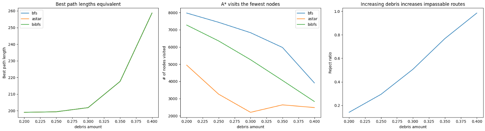

# Search Algorithms

Small demo of search/pathfinding algorithms, including a browser UI and python implementations of three algorithms:
 - Breadth-first search
 - A* pathfinding
 - Bidirectional breadth-first search

## UI

To start the ui, open `web/index.html` in any web browser.

Then choose a search type and click "start".

## Analysis

Three search algorithms were tested on 100x100 grids, with the start fixed in the top left corner and the target fixed in the bottom right. Impassable "debris" squares were added in ratios from 20% to 40%. 

In cases where no path was possible between the start and target squares, the sample was discarded.

Findings:
 - Among the three search algorithms, A* consistently performs the best, exploring far fewer nodes than Bi-BFS or BFS.
 - Bi-BFS was better than vanilla BFS, but still explored more nodes than A*.
 - As the amount of debris increased, the reject ratio increased roughly linearly
 - Debris ratios over 40% led to too many rejects.

